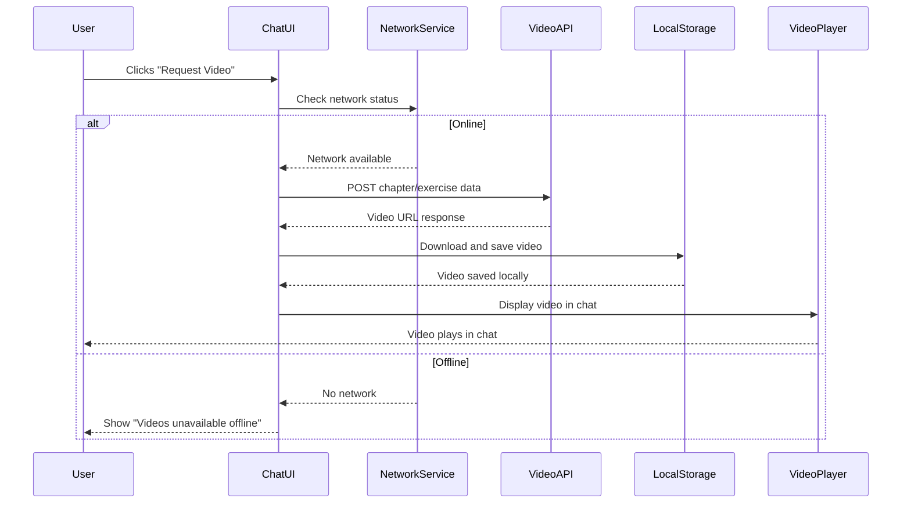
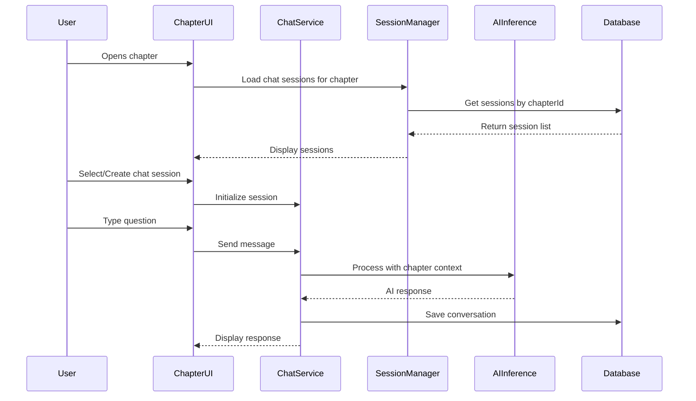
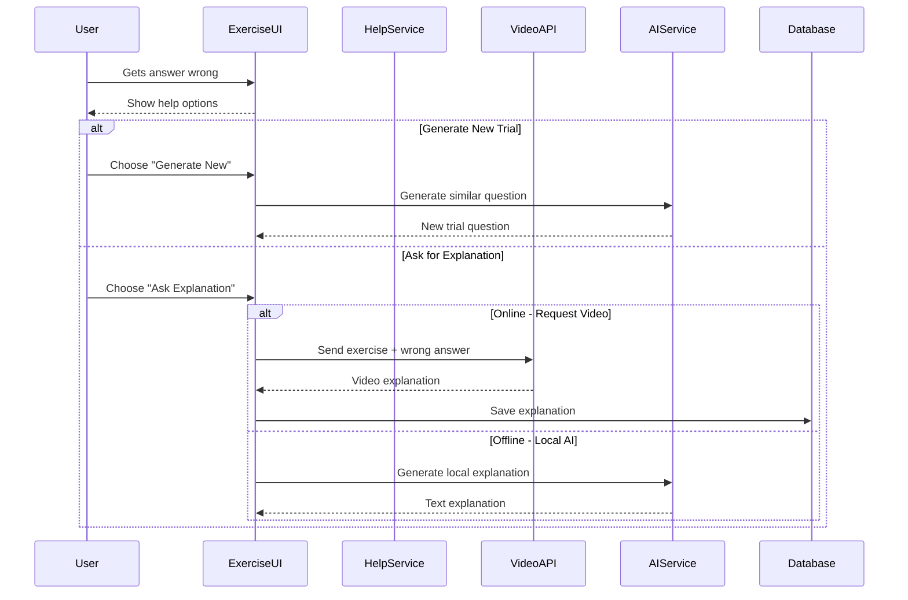

markdown# AI Tutor App - Technical Design

## Architecture Overview

### High-Level Architecture
┌─────────────────────────────────────┐
│               :app                  │
├─────────────────────────────────────┤
│  :feature:chat    :feature:courses  │
│  :feature:camera  :feature:progress │
├─────────────────────────────────────┤
│  :core:ai        :core:data         │
│  :core:database  :core:ui           │
│  :core:common    :core:designsystem │
│  :core:network   :core:datastore    │ ← NEW: Network module
├─────────────────────────────────────┤
│  :ai:modelmanager :ai:inference     │
│  :ai:rag          :ai:service       │
└─────────────────────────────────────┘

### Module Dependencies
- **:app** → all feature modules
- **:feature:*** → :core:*, :ai:*
- **:core:ai** → :ai:modelmanager, :ai:inference
- **:core:network** → video API integration ← NEW
- **:ai:*** → :core:common, :core:data

## UI/UX Design Specifications

### 1. Chapter Interface Layout (Gallery-Style Split Screen)

```
┌─────────────────────────────────────────────────────────────────────────┐
│                          Chapter: Linear Equations                        │
├─────────────────────────┬───────────────────────────────────────────────┤
│                         │                                               │
│   📖 CHAPTER CONTENT    │           💬 CHAT INTERFACE                   │
│                         │                                               │
│ # Linear Equations      │ ┌─────────────────────────────────────────┐   │
│                         │ │         Chat Sessions                   │   │
│ Linear equations are... │ │ ┌─────────────────────────────────────┐ │   │
│                         │ │ │ 📝 "Understanding basics"  [Active] │ │   │
│ ## Example 1:           │ │ │ 📝 "Practice problems"             │ │   │
│ Solve: 2x + 5 = 15      │ │ │ 📝 "Step-by-step solutions"       │ │   │
│                         │ │ │ [+ New Chat Session]               │ │   │
│ Step 1: Subtract 5...   │ │ └─────────────────────────────────────┘ │   │
│ Step 2: Divide by 2...  │ └─────────────────────────────────────────┘   │
│                         │                                               │
│ ## Practice Problems:   │ ┌─────────────────────────────────────────┐   │
│ 1. Solve: 3x - 7 = 8    │ │           Active Chat                   │   │
│ 2. Solve: x/4 + 2 = 6   │ │                                         │   │
│                         │ │ 👤 User: "I don't understand step 2"   │   │
│ [📊 Test Yourself]      │ │                                         │   │
│                         │ │ 🤖 AI: "Step 2 involves dividing both  │   │
│                         │ │     sides by the coefficient..."        │   │
│                         │ │                                         │   │
│                         │ │ 👤 User: "Can you show me visually?"   │   │
│                         │ │                                         │   │
│                         │ │ [🎥 REQUEST VIDEO] [💬 ASK MORE]        │   │
│                         │ │                                         │   │
│                         │ │ ⏳ Requesting video explanation...      │   │
│                         │ │                                         │   │
│                         │ │ 📹 [Video Player - 1.2MB]              │   │
│                         │ │    "Visual Guide to Linear Equations"  │   │
│                         │ │    ▶️ [0:00 / 2:30]                     │   │
│                         │ │                                         │   │
│                         │ └─────────────────────────────────────────┘   │
│                         │                                               │
│                         │ ┌─────────────────────────────────────────┐   │
│                         │ │ 💬 Type your question...                │   │
│                         │ │ [Send] [🎥 Request Video] [🌐 Online]   │   │
│                         │ └─────────────────────────────────────────┘   │
└─────────────────────────┴───────────────────────────────────────────────┘
```

### 2. Exercise Help Interface (Separate Section)

```
┌─────────────────────────────────────────────────────────────────────────┐
│                           🧪 EXERCISE HELP                              │
├─────────────────────────────────────────────────────────────────────────┤
│                                                                         │
│ ❌ Exercise #3: Solve 2x + 7 = 19                                       │
│                                                                         │
│ Your Answer: ❌ x = 5    Correct Answer: ✅ x = 6                       │
│                                                                         │
│ ┌─────────────────────────┬─────────────────────────────────────────┐   │
│ │    🔄 GENERATE NEW      │         ❓ ASK FOR EXPLANATION         │   │
│ │        TRIAL            │                                         │   │
│ │                         │  ┌─────────────────────────────────┐   │   │
│ │ Create a new similar    │  │ 💬 Ask Locally (AI)             │   │   │
│ │ question to practice    │  │                                 │   │   │
│ │                         │  │ 🤖 "You subtracted 7 instead   │   │   │
│ │ [Generate Question]     │  │    of adding. The correct...    │   │   │
│ │                         │  └─────────────────────────────────┘   │   │
│ │                         │                                         │   │
│ │                         │  ┌─────────────────────────────────┐   │   │
│ │                         │  │ 🎥 Request Video (Online)       │   │   │
│ │                         │  │                                 │   │   │
│ │                         │  │ 📹 [Video Player - 0.8MB]      │   │   │
│ │                         │  │    "Why x=5 is Wrong"          │   │   │
│ │                         │  │    ▶️ [0:00 / 1:45]             │   │   │
│ │                         │  └─────────────────────────────────┘   │   │
│ └─────────────────────────┴─────────────────────────────────────────┘   │
│                                                                         │
│ 📚 Previous Explanations for this Exercise:                            │
│ • 🎥 "Why x=5 is Wrong" (2 days ago)                                   │
│ • 💬 "Step-by-step breakdown" (1 week ago)                             │
└─────────────────────────────────────────────────────────────────────────┘
```

### 3. Network State Indicators

```
Online Mode:
┌─────────────────────────────────────────┐
│ [💬 Send] [🎥 Request Video] [🌐 Online] │
└─────────────────────────────────────────┘

Offline Mode:
┌─────────────────────────────────────────┐
│ [💬 Send] [⚠️ Videos unavailable offline]│
└─────────────────────────────────────────┘

Loading Video:
┌─────────────────────────────────────────┐
│ [💬 Send] [⏳ Requesting video...] [❌]  │
└─────────────────────────────────────────┘
```

### 4. Chat Session Management

```
┌─────────────────────────────────────────┐
│         📝 Chat Sessions                │
├─────────────────────────────────────────┤
│ 🔵 "Understanding basics" (Active)      │
│    └─ 5 messages, 2 videos             │
│                                         │
│ ⚫ "Practice problems"                   │
│    └─ 12 messages, 1 video             │
│                                         │
│ ⚫ "Step-by-step solutions"             │
│    └─ 8 messages, 0 videos             │
│                                         │
│ ┌─────────────────────────────────────┐ │
│ │ ➕ Create New Chat Session          │ │
│ │ 💭 Name: [Enter session name...]    │ │
│ │ [Create] [Cancel]                   │ │
│ └─────────────────────────────────────┘ │
└─────────────────────────────────────────┘
```

### 5. Chapter Test System (NEW)

```
Chapter Reading View (Bottom of Content):
┌─────────────────────────────────────────────────────────────────────────┐
│ ... chapter markdown content ...                                        │
│                                                                         │
│ ## Summary                                                              │
│ This chapter covered linear equations and their applications...         │
│                                                                         │
│ ┌─────────────────────────────────────────────────────────────────────┐ │
│ │                    🎯 Take Test (5 Questions)                      │ │  ← NEW: Visible when !chapter.isCompleted
│ │                   Test your understanding!                         │ │
│ └─────────────────────────────────────────────────────────────────────┘ │
│                                                                         │
│ ┌─────────────────────────────────────────────────────────────────────┐ │
│ │          ✅ Retake Test (Score: 80%) | Chapter Complete             │ │  ← NEW: Visible when chapter.isCompleted  
│ └─────────────────────────────────────────────────────────────────────┘ │
└─────────────────────────────────────────────────────────────────────────┘

Kahoot-Style Test Interface:
┌─────────────────────────────────────────────────────────────────────────┐
│ Chapter Test: Linear Equations                                          │
│ ████████████████████████████████░░░░░░░░░░░░ 4/5 (80%)                  │ ← Progress bar
├─────────────────────────────────────────────────────────────────────────┤
│                                                                         │
│ Question 4 of 5:                                                        │
│ What is the solution to the equation 3x - 7 = 14?                      │
│                                                                         │
│ ┌─────────────────────────────┬─────────────────────────────────────┐   │
│ │    🔴 A) x = 5              │    🔵 B) x = 7                      │   │ ← Kahoot colors
│ └─────────────────────────────┴─────────────────────────────────────┘   │
│ ┌─────────────────────────────┬─────────────────────────────────────┐   │
│ │    🟡 C) x = 9              │    🟢 D) x = 21                     │   │
│ └─────────────────────────────┴─────────────────────────────────────┘   │
│                                                                         │
│ [← Previous]     [1] [2] [3] [4] [5]     [Next →]                       │
│                                                                         │
│ [Submit Test] ← Only visible on question 5 or when all answered         │
└─────────────────────────────────────────────────────────────────────────┘

Test Results Interface:
┌─────────────────────────────────────────────────────────────────────────┐
│                          🎯 Test Results                                │
├─────────────────────────────────────────────────────────────────────────┤
│                                                                         │
│                          Your Score: 80%                               │
│                           4 out of 5 correct                           │
│                                                                         │
│ ❌ Chapter Not Complete (100% required)                                 │
│                                                                         │
│ 📝 Questions you got wrong:                                             │
│                                                                         │
│ ❌ Question 2: What is the slope of y = 3x + 5?                         │
│    Your answer: 5 | Correct answer: 3                                  │
│    ┌─────────────────────────────────────────────────────────────────┐ │
│    │ [❓ Request Explanation] [🔄 Generate New Trial]                │ │ ← Reuse ExerciseHelp
│    └─────────────────────────────────────────────────────────────────┘ │
│                                                                         │
│ ┌─────────────────────────────────────────────────────────────────────┐ │
│ │ 🔄 Retake Full Test    📚 Back to Chapter    ➡️ Continue Learning   │ │
│ └─────────────────────────────────────────────────────────────────────┘ │
└─────────────────────────────────────────────────────────────────────────┘

Perfect Score (100%) Result:
┌─────────────────────────────────────────────────────────────────────────┐
│                          🎉 Perfect Score!                             │
├─────────────────────────────────────────────────────────────────────────┤
│                                                                         │
│                          Your Score: 100%                              │
│                           5 out of 5 correct                           │
│                                                                         │
│ ✅ Chapter Complete! Unlocking next chapter...                          │
│                                                                         │
│ ┌─────────────────────────────────────────────────────────────────────┐ │
│ │ 🎊 Continue to Next Chapter    📚 Return to Chapter                 │ │
│ └─────────────────────────────────────────────────────────────────────┘ │
└─────────────────────────────────────────────────────────────────────────┘
```

## Data Flow Architecture

### 1. Video Request Flow


### 2. Chapter Chat Session Flow


### 3. Exercise Help Flow


## Updated Data Models

### Core Data Models (Renamed: Lessons → Chapters)
```kotlin
data class Course(
    val id: String,
    val title: String,
    val subject: Subject,
    val grade: String,
    val description: String,
    val chapters: List<Chapter>, // RENAMED from lessons
    val totalChapters: Int, // RENAMED from totalLessons
    val estimatedHours: Int,
    val imageUrl: String? = null,
    val isDownloaded: Boolean = false,
    val downloadUrl: String? = null,
    val sizeInBytes: Long = 0L,
    val version: String = "1.0",
    val createdAt: Long = System.currentTimeMillis(),
    val updatedAt: Long = System.currentTimeMillis()
)

data class Chapter( // RENAMED from Lesson
    val id: String,
    val courseId: String,
    val chapterNumber: Int, // RENAMED from lessonNumber
    val title: String,
    val markdownContent: String,
    val imageReferences: List<String> = emptyList(),
    val estimatedReadingTime: Int,
    val isCompleted: Boolean = false, // NEW: TRUE only when test score = 100%
    val exercises: List<Exercise> = emptyList(), // EXACTLY 5 exercises = test questions
    val testScore: Int? = null, // NEW: Latest test score (0-100)
    val testAttempts: Int = 0, // NEW: Number of test attempts
    val lastTestAttempt: Long? = null, // NEW: Timestamp of last test
    val chatSessions: List<ChatSession> = emptyList(), // NEW
    val createdAt: Long = System.currentTimeMillis()
)

// EXISTING: Exercise Model (PERFECT for test questions)
data class Exercise(
    val id: String,
    val chapterId: String, // Links test questions to chapters
    val questionText: String,
    val options: List<String>, // 4 multiple choice options
    val correctAnswerIndex: Int,
    val explanation: String, // Used for wrong answer explanations
    val difficulty: Difficulty = Difficulty.MEDIUM,
    val isCompleted: Boolean = false, // Set when user answers
    val userAnswer: Int? = null, // User's selected answer (0-3)
    val isCorrect: Boolean? = null, // Whether user got it right
    val createdAt: Long = System.currentTimeMillis()
)

// EXISTING: Trial Model (PERFECT for AI-generated retries)
data class Trial(
    val id: String,
    val originalExerciseId: String, // Links back to failed exercise
    val questionText: String,
    val options: List<String>,
    val correctAnswerIndex: Int,
    val explanation: String,
    val difficulty: Difficulty = Difficulty.MEDIUM,
    val isCompleted: Boolean = false,
    val userAnswer: Int? = null,
    val isCorrect: Boolean? = null,
    val generatedAt: Long = System.currentTimeMillis() // AI generation timestamp
)

// NEW: Test-Specific Wrapper for UI State
data class ChapterTest(
    val chapterId: String,
    val exercises: List<Exercise>, // Exactly 5 exercises from chapter
    val currentQuestionIndex: Int = 0,
    val userAnswers: List<Int?> = List(5) { null }, // Track all 5 answers
    val isCompleted: Boolean = false,
    val score: Int? = null // Calculated when test submitted
)

// NEW: Test Result Processing
data class TestResult(
    val chapterId: String,
    val score: Int, // 0-100 percentage
    val correctAnswers: Int,
    val totalQuestions: Int = 5,
    val wrongExercises: List<Exercise>, // Exercises user got wrong
    val isPassing: Boolean = score == 100, // Only 100% marks chapter complete
    val completedAt: Long = System.currentTimeMillis()
)

// NEW: Video Explanation Entity
data class VideoExplanation(
    val id: String,
    val userId: String, // User-specific, no sharing
    val chapterId: String? = null, // For chapter videos
    val exerciseId: String? = null, // For exercise videos
    val requestType: VideoRequestType,
    val userQuestion: String,
    val contextData: String, // JSON of chapter markdown or exercise data
    val videoUrl: String, // Original API URL
    val localFilePath: String, // Local storage path
    val fileSizeBytes: Long,
    val durationSeconds: Int,
    val createdAt: Long = System.currentTimeMillis(),
    val lastAccessedAt: Long = System.currentTimeMillis()
)

enum class VideoRequestType {
    CHAPTER_EXPLANATION,
    EXERCISE_HELP
}

// Updated: Chapter-specific Chat Sessions
data class ChatSession(
    val id: String,
    val title: String,
    val chapterId: String, // Always linked to a chapter
    val courseId: String,
    val userId: String, // User-specific sessions
    val createdAt: Long = System.currentTimeMillis(),
    val lastMessageAt: Long = System.currentTimeMillis(),
    val isActive: Boolean = true,
    val messageCount: Int = 0,
    val videoCount: Int = 0 // Track videos in session
)

// Updated: Enhanced Chat Messages
data class ChatMessage(
    val id: String,
    val sessionId: String,
    val content: String,
    val isUser: Boolean,
    val timestamp: Long = System.currentTimeMillis(),
    val messageType: MessageType,
    val videoExplanation: VideoExplanation? = null, // NEW: Embedded video
    val mathSteps: List<MathStep> = emptyList(),
    val status: MessageStatus = MessageStatus.SENT,
    val relatedExerciseId: String? = null,
    val processingTimeMs: Long = 0L
)

enum class MessageType {
    TEXT,
    VIDEO, // NEW
    IMAGE,
    MATH_SOLUTION,
    EXERCISE_HELP
}

// NEW: Exercise Help System
data class ExerciseHelp(
    val id: String,
    val exerciseId: String,
    val userId: String,
    val incorrectAnswer: Int,
    val correctAnswer: Int,
    val userQuestion: String? = null,
    val helpType: HelpType,
    val explanation: String? = null, // For local AI explanations
    val videoExplanation: VideoExplanation? = null, // For video explanations
    val createdAt: Long = System.currentTimeMillis(),
    val wasHelpful: Boolean? = null // User feedback
)

enum class HelpType {
    LOCAL_AI,
    VIDEO_EXPLANATION,
    NEW_TRIAL
}

// Note: Network connectivity is handled by existing NetworkMonitor interface in core:data
// Use networkMonitor.isOnline Flow<Boolean> for video feature availability
```

### Database Schema Updates (Room)

```kotlin
@Entity(tableName = "chapters") // RENAMED from lessons
data class ChapterEntity(
    @PrimaryKey val id: String,
    val courseId: String,
    val chapterNumber: Int, // RENAMED
    val title: String,
    val markdownContent: String,
    val imageReferences: String, // JSON array
    val estimatedReadingTime: Int,
    val isCompleted: Boolean,
    val createdAt: Long
)

@Entity(tableName = "video_explanations") // NEW
data class VideoExplanationEntity(
    @PrimaryKey val id: String,
    val userId: String,
    val chapterId: String?,
    val exerciseId: String?,
    val requestType: String, // VideoRequestType enum
    val userQuestion: String,
    val contextData: String, // JSON
    val videoUrl: String,
    val localFilePath: String,
    val fileSizeBytes: Long,
    val durationSeconds: Int,
    val createdAt: Long,
    val lastAccessedAt: Long
)

@Entity(tableName = "chat_sessions")
data class ChatSessionEntity(
    @PrimaryKey val id: String,
    val title: String,
    val chapterId: String, // Always required
    val courseId: String,
    val userId: String, // NEW: User-specific
    val createdAt: Long,
    val lastMessageAt: Long,
    val isActive: Boolean,
    val messageCount: Int,
    val videoCount: Int // NEW
)

@Entity(tableName = "exercise_help") // NEW
data class ExerciseHelpEntity(
    @PrimaryKey val id: String,
    val exerciseId: String,
    val userId: String,
    val incorrectAnswer: Int,
    val correctAnswer: Int,
    val userQuestion: String?,
    val helpType: String, // HelpType enum
    val explanation: String?,
    val videoExplanationId: String?, // FK to video_explanations
    val createdAt: Long,
    val wasHelpful: Boolean?
)
```

## API Integration Layer

### Video Request Service
```kotlin
interface VideoExplanationService {
    
    @POST("api/video/chapter")
    suspend fun requestChapterVideo(
        @Body request: ChapterVideoRequest
    ): VideoResponse
    
    @POST("api/video/exercise")
    suspend fun requestExerciseVideo(
        @Body request: ExerciseVideoRequest
    ): VideoResponse
}

data class ChapterVideoRequest(
    val chapterMarkdown: String,
    val userQuestion: String,
    val userId: String,
    val chapterId: String
)

data class ExerciseVideoRequest(
    val exerciseText: String,
    val options: List<String>,
    val correctChoice: Int,
    val incorrectChoice: Int,
    val userQuestion: String?,
    val userId: String,
    val exerciseId: String
)

data class VideoResponse(
    val videoUrl: String,
    val title: String,
    val durationSeconds: Int,
    val fileSizeBytes: Long,
    val format: String = "mp4",
    val success: Boolean,
    val errorMessage: String? = null
)
```

### Local Video Manager
```kotlin
@Singleton
class VideoManager @Inject constructor(
    private val context: Context,
    private val database: ElizaDatabase
) {
    
    suspend fun downloadAndStoreVideo(
        videoResponse: VideoResponse,
        explanation: VideoExplanation
    ): Result<String>
    
    suspend fun getLocalVideoPath(videoId: String): String?
    
    suspend fun deleteVideo(videoId: String): Result<Unit>
    
    suspend fun getStorageUsage(): StorageInfo
    
    suspend fun cleanupOldVideos(maxAgeMillis: Long): List<String>
}

data class StorageInfo(
    val totalVideos: Int,
    val totalSizeBytes: Long,
    val availableSpaceBytes: Long,
    val oldestVideoDate: Long
)

### Existing Network Monitor (Already Implemented)
```kotlin
// EXISTING interface in core:data - DO NOT recreate
interface NetworkMonitor {
    val isOnline: Flow<Boolean>
}

// EXISTING implementation - ENHANCE this for video features
@Singleton
class SimpleNetworkMonitor @Inject constructor() : NetworkMonitor {
    override val isOnline: Flow<Boolean> = flowOf(true) // TODO: Enhance for actual detection
}

// EXISTING integration in ElizaAppState
class ElizaAppState(
    val navController: NavHostController,
    coroutineScope: CoroutineScope,
    networkMonitor: NetworkMonitor, // Already injected
) {
    val isOffline = networkMonitor.isOnline  // Already exposed
        .map(Boolean::not)
        .stateIn(...)
}

// For video features, use existing NetworkMonitor.isOnline Flow<Boolean>
```

## Component Architecture

### 1. Chapter Chat Service
```kotlin
@Singleton
class ChapterChatService @Inject constructor(
    private val chatRepository: ChatRepository,
    private val aiService: ElizaChatService,
    private val videoService: VideoExplanationService,
    private val videoManager: VideoManager,
    private val networkMonitor: NetworkMonitor // Use existing NetworkMonitor interface
) {
    
    suspend fun sendTextMessage(
        sessionId: String,
        message: String
    ): Flow<ChatResponse>
    
    suspend fun requestVideoExplanation(
        sessionId: String,
        chapterId: String,
        userQuestion: String
    ): Flow<VideoRequestResult>
    
    fun getSessionsForChapter(chapterId: String): Flow<List<ChatSession>>
    
    suspend fun createNewSession(
        chapterId: String,
        title: String
    ): ChatSession
}
```

### 2. Exercise Help Service
```kotlin
@Singleton  
class ExerciseHelpService @Inject constructor(
    private val exerciseRepository: ExerciseRepository,
    private val aiService: ElizaChatService,
    private val videoService: VideoExplanationService,
    private val networkMonitor: NetworkMonitor
) {
    
    suspend fun generateNewTrial(exerciseId: String): Trial
    
    suspend fun getLocalExplanation(
        exerciseId: String,
        incorrectAnswer: Int,
        userQuestion: String?
    ): ExerciseHelp
    
    suspend fun requestVideoExplanation(
        exerciseId: String,
        incorrectAnswer: Int,
        userQuestion: String?
    ): Flow<VideoRequestResult>
    
    fun getHelpHistory(exerciseId: String): Flow<List<ExerciseHelp>>
}
```

### 3. Network-Aware UI Components
```kotlin
@Composable
fun VideoRequestButton(
    onRequestVideo: () -> Unit,
    isLoading: Boolean = false,
    modifier: Modifier = Modifier
) {
    // Use existing NetworkMonitor.isOnline Flow<Boolean>
    val isOnline by networkMonitor.isOnline.collectAsState(initial = false)
    
    when {
        !isOnline -> {
            Button(
                onClick = { },
                enabled = false,
                modifier = modifier
            ) {
                Icon(Icons.Default.WifiOff, contentDescription = null)
                Text("Videos unavailable offline")
            }
        }
        isLoading -> {
            Button(
                onClick = { },
                enabled = false,
                modifier = modifier
            ) {
                CircularProgressIndicator(modifier = Modifier.size(16.dp))
                Text("Requesting video...")
            }
        }
        else -> {
            Button(
                onClick = onRequestVideo,
                modifier = modifier
            ) {
                Icon(Icons.Default.VideoLibrary, contentDescription = null)
                Text("Request Video")
            }
        }
    }
}

@Composable
fun ChatInterface(
    chapterId: String,
    sessions: List<ChatSession>,
    activeSessionId: String?,
    messages: List<ChatMessage>,
    onSendMessage: (String) -> Unit,
    onRequestVideo: (String) -> Unit,
    onCreateSession: (String) -> Unit,
    modifier: Modifier = Modifier
) {
    // Implementation with split layout matching design
}
```

## Performance Considerations

### Video Management
- Maximum 2MB per video file
- Local storage cleanup for videos older than 30 days
- Lazy loading of video thumbnails
- Background video downloads with progress indicators

### Chat Performance
- Limit to 50 messages per session for UI performance
- Lazy loading of older messages
- Efficient database queries with proper indexing
- Message pagination for large conversations

### Network Optimization
- Retry mechanism for failed video requests
- Graceful degradation when network is poor
- Request queuing for offline-to-online transitions
- Bandwidth-aware video quality selection

## Testing Strategy

### UI Testing
- Chapter interface layout responsiveness
- Chat session creation and switching
- Video player integration
- Network state change handling

### Integration Testing  
- Video download and playback flow
- Chat message persistence
- Exercise help system workflow
- Offline/online mode transitions

### Performance Testing
- Video storage and retrieval speed
- Chat interface responsiveness with many sessions
- Memory usage during video playback
- Battery consumption during video requests