# Eliza Model Variant Switching System

## Overview

This system implements Google's **MatFormer (Matryoshka Transformer)** architecture for Gemma 3n models, enabling seamless switching between different model variants without re-downloading.

## Key Features

### 🎯 MatFormer Architecture
- **Single Download**: Only need to download E4B model (4.4GB)
- **Nested Models**: E2B model is contained within E4B as a subset
- **Parameter Sharing**: Uses shared parameters and nested FFN blocks
- **PLE (Per-Layer Embeddings)**: Reduces memory footprint by offloading embeddings to CPU

### 📊 Available Variants
- **E4B (4B effective params)**: Highest quality, ~7GB memory
- **E2B (2B effective params)**: 2x faster inference, ~3.5GB memory

## Quick Start

### 1. Easy Configuration

Change the default model variant in `ModelConfig.kt`:

```kotlin
// Change this single line to switch default variant
val DEFAULT_VARIANT = GemmaVariant.GEMMA_3N_E4B  // or GEMMA_3N_E2B
```

### 2. Manual Variant Switching

```kotlin
// Inject the model manager
@Inject lateinit var modelManager: ElizaModelManager

// Switch to high-quality variant
modelManager.switchToVariant(GemmaVariant.GEMMA_3N_E4B)

// Switch to fast variant
modelManager.switchToVariant(GemmaVariant.GEMMA_3N_E2B)
```

### 3. Use Case-Based Selection

```kotlin
// Get variant based on use case
val variant = ModelConfig.getVariantForUseCase(UseCase.EDUCATIONAL_TUTORING)
modelManager.switchToVariant(variant)
```

### 4. Device-Adaptive Selection

```kotlin
// Get recommended variant based on device capabilities
val recommendedVariant = modelManager.getRecommendedVariant()
modelManager.switchToVariant(recommendedVariant)
```

## Configuration Options

### Memory Thresholds
```kotlin
object MemoryThresholds {
    const val E4B_MIN_MEMORY_GB = 6.0f    // Minimum for E4B
    const val E2B_MIN_MEMORY_GB = 3.0f    // Minimum for E2B
    const val FALLBACK_THRESHOLD_GB = 2.5f // Fallback to E2B
}
```

### Automatic Switching
```kotlin
const val ENABLE_AUTO_SWITCHING = true
const val AUTO_SWITCH_MEMORY_THRESHOLD = 0.8f // Switch when memory > 80%
```

### Performance Monitoring
```kotlin
const val ENABLE_PERFORMANCE_MONITORING = true
const val PRELOAD_NESTED_VARIANTS = true // For faster switching
```

## MatFormer Architecture Details

### How It Works
1. **Single Model File**: Download only the E4B model
2. **Nested Subsets**: E2B is extracted from E4B parameters
3. **Parameter Selection**: Choose which parameters to activate
4. **Memory Optimization**: PLE reduces GPU memory usage

### Benefits
- **No Re-downloading**: Switch instantly between variants
- **Memory Efficient**: PLE keeps core parameters in CPU
- **Performance Flexible**: Choose speed vs quality trade-off
- **Device Adaptive**: Automatically adapt to device capabilities

## Implementation Status

### ✅ Completed
- [x] GemmaVariant enum with E4B/E2B support
- [x] ElizaModelRegistry for variant management
- [x] ModelConfig for easy configuration
- [x] Updated ElizaModelManager to use registry
- [x] Deprecated old hardcoded model references

### 🔄 In Progress
- [ ] MediaPipe LLM inference parameter switching
- [ ] UI components for variant selection
- [ ] Automatic switching based on device capabilities
- [ ] Performance monitoring and benchmarking

## Usage Examples

### Educational Tutoring App
```kotlin
// Use highest quality for education
val variant = ModelConfig.getVariantForUseCase(UseCase.EDUCATIONAL_TUTORING)
modelManager.switchToVariant(variant)
```

### Quick Response Chat
```kotlin
// Use fastest variant for quick responses
val variant = ModelConfig.getVariantForUseCase(UseCase.QUICK_RESPONSES)
modelManager.switchToVariant(variant)
```

### Resource-Constrained Devices
```kotlin
// Use memory-efficient variant
val variant = ModelConfig.getVariantForUseCase(UseCase.RESOURCE_CONSTRAINED)
modelManager.switchToVariant(variant)
```

## API Reference

### ElizaModelManager
```kotlin
// Switch to specific variant
fun switchToVariant(targetVariant: GemmaVariant)

// Get device recommendation
fun getRecommendedVariant(): GemmaVariant

// Check if variant is available
fun isVariantAvailable(variant: GemmaVariant): Boolean

// Get performance info
fun getPerformanceInfo(variant: GemmaVariant): String
```

### ModelConfig
```kotlin
// Quick variant selection
fun useHighQualityVariant(): GemmaVariant
fun useFastVariant(): GemmaVariant

// Use case-based selection
fun getVariantForUseCase(useCase: UseCase): GemmaVariant
```

## Best Practices

1. **Start with E4B**: Default to highest quality, switch to E2B if needed
2. **Monitor Performance**: Enable performance monitoring for optimal selection
3. **Use Auto-switching**: Enable automatic switching for better user experience
4. **Preload Variants**: Enable preloading for faster switching
5. **Test on Target Devices**: Verify performance on actual deployment devices

## Troubleshooting

### Common Issues

**Model switching takes too long**
- Enable `PRELOAD_NESTED_VARIANTS = true`
- Check if model is already downloaded

**Out of memory errors**
- Lower `AUTO_SWITCH_MEMORY_THRESHOLD`
- Enable automatic switching
- Use E2B variant for low-memory devices

**Performance issues**
- Enable performance monitoring
- Use device-adaptive selection
- Consider automatic switching based on performance

## Future Features

- **Mix'n'Match**: Custom model sizes between E2B and E4B
- **Elastic Execution**: Dynamic switching during inference
- **Advanced PLE**: More sophisticated memory optimization
- **Performance Profiling**: Detailed performance analytics 

```mermaid
graph TB
    subgraph "User Input"
        A[User Question + Context]
    end

    subgraph "ElizaChatService (RAG + MatFormer)"
        B[Select Optimal Variant]
        C[Ensure Model Initialized]
        D[RAG Enhancement]
        E[Build Final Prompt]
        F[Variant-Optimized Inference]
    end

    subgraph "Variant Selection Logic"
        G[ChapterReading → E2B]
        H[ExerciseSolving → E4B]
        I[Revision → E2B]
        J[GeneralTutoring → Auto]
    end

    subgraph "ModelManager (MatFormer)"
        K[Model Initialization]
        L[Variant Switching]
        M[Performance Monitoring]
    end

    subgraph "InferenceHelper (MediaPipe)"
        N[Variant-Optimized Session]
        O[Parameter Configuration]
        P[Memory Management]
    end

    subgraph "RAG System"
        Q[Content Retrieval]
        R[Prompt Enhancement]
        S[Context Integration]
    end

    A --> B
    B --> G
    B --> H
    B --> I
    B --> J
    B --> C
    C --> K
    C --> L
    L --> M
    C --> D
    D --> Q
    D --> R
    D --> S
    D --> E
    E --> F
    F --> N
    N --> O
    N --> P

    style B fill:#e1f5fe
    style C fill:#e8f5e8
    style D fill:#fff3e0
    style F fill:#f3e5f5
```


```


