```mermaid
graph TB
    subgraph "User Input"
        A[User Question + Context]
    end

    subgraph "ElizaChatService (RAG + MatFormer)"
        B[Select Optimal Variant]
        C[Ensure Model Initialized]
        D[RAG Enhancement]
        E[Build Final Prompt]
        F[Variant-Optimized Inference]
    end

    subgraph "Variant Selection Logic"
        G[ChapterReading → E2B]
        H[ExerciseSolving → E4B]
        I[Revision → E2B]
        J[GeneralTutoring → Auto]
    end

    subgraph "ModelManager (MatFormer)"
        K[Model Initialization]
        L[Variant Switching]
        M[Performance Monitoring]
    end

    subgraph "InferenceHelper (MediaPipe)"
        N[Variant-Optimized Session]
        O[Parameter Configuration]
        P[Memory Management]
    end

    subgraph "RAG System"
        Q[Content Retrieval]
        R[Prompt Enhancement]
        S[Context Integration]
    end

    A --> B
    B --> G
    B --> H
    B --> I
    B --> J
    B --> C
    C --> K
    C --> L
    L --> M
    C --> D
    D --> Q
    D --> R
    D --> S
    D --> E
    E --> F
    F --> N
    N --> O
    N --> P

    style B fill:#e1f5fe
    style C fill:#e8f5e8
    style D fill:#fff3e0
    style F fill:#f3e5f5
```

# Eliza AI Module

## Overview

This system implements Google's MatFormer (Matryoshka Transformer) architecture for Gemma 3n models, enabling seamless switching between different model variants without re-downloading.


## Key Features

### 🎯 MatFormer Architecture
- **Single Download**: Only need to download E4B model (4.4GB)
- **Nested Models**: E2B model is contained within E4B as a subset
- **Parameter Sharing**: Uses shared parameters and nested FFN blocks
- **PLE (Per-Layer Embeddings)**: Reduces memory footprint by offloading embeddings to CPU

### 📊 Available Variants
- **E4B (4B effective params)**: Highest quality, ~7GB memory
- **E2B (2B effective params)**: 2x faster inference, ~3.5GB memory


## Directory Structure

The `ai` module is organized into the following sub-modules:

-   **/inference**: Handles the core logic for running the AI model.
-   **/modelmanager**: Manages the AI models, including downloading, variant switching, and lifecycle.
-   **/rag**: Implements the Retrieval-Augmented Generation (RAG) functionality to enhance prompts with contextual data.


### Inference Module

The `inference` module contains the following key components:

-   **ElizaInferenceHelper**: A helper class that abstracts the complexities of interacting with the MediaPipe LLM inference engine. It provides a clean and simple API for initializing models, running inference, and managing model variants.
-   **ElizaChatService**: A high-level service that combines the capabilities of the inference helper and the RAG provider to generate intelligent, context-aware responses.

### ModelManager Module

The `modelmanager` module is responsible for managing the lifecycle of the AI models. It is further divided into two sub-packages:

-   **/download**: Contains the components responsible for downloading the AI models from remote sources.
    -   **DownloadWorker**: A `WorkManager` worker that handles the model download process in the background.
    -   **ModelDownloadRepository**: A repository that provides a clean API for downloading models and observing their progress.
    -   **WorkerConstants**: A set of constants used by the download worker and repository.
-   **/manager**: Contains the core logic for managing the AI models.
    -   **ElizaModelManager**: A `ViewModel` that manages the state of the AI model and provides a simple interface for initializing, switching, and interacting with the model.
    -   **ElizaModelRegistry**: A registry that manages the available model variants and their configurations.

### RAG Module

The `rag` module provides the components for Retrieval-Augmented Generation:

-   **RagProvider**: An interface that defines the contract for providing contextual data to the AI model.
-   **RagProviderFactory**: A factory that creates the appropriate RAG provider based on the current context.

## MatFormer Architecture

The Eliza AI module is built around the MatFormer architecture, which allows for efficient switching between different model variants. This is achieved by using a single, large model (E4B) that contains a smaller, nested model (E2B) as a subset of its parameters.

### Key Benefits

-   **No Re-downloading**: Switch instantly between variants without needing to download additional files.
-   **Memory Efficiency**: The Per-Layer Embeddings (PLE) technique reduces the GPU memory footprint by offloading embeddings to the CPU.
-   **Performance Flexibility**: Choose between a high-quality variant (E4B) and a faster, more efficient variant (E2B) based on the use case and device capabilities.
-   **Device-Adaptive**: Automatically adapts to the device's capabilities to provide the best possible user experience.

## Usage

### Switching Variants

To switch between model variants, you can use the `ElizaModelManager`:

```kotlin
// Inject the model manager
@Inject lateinit var modelManager: ElizaModelManager

// Switch to the high-quality variant
modelManager.switchToVariant("gemma-3n-E4B")

// Switch to the fast variant
modelManager.switchToVariant("gemma-3n-E2B")
```

### Use-Case-Based Selection

The `ElizaChatService` automatically selects the optimal variant based on the current educational context, ensuring the best balance of performance and quality for each use case.

### Device-Adaptive Selection

The `ElizaModelManager` can also recommend a variant based on the device's capabilities, ensuring that the app runs smoothly even on resource-constrained devices.

```kotlin
// Get the recommended variant for the current device
val recommendedVariant = modelManager.getRecommendedVariant()
modelManager.switchToVariant(recommendedVariant)
```




