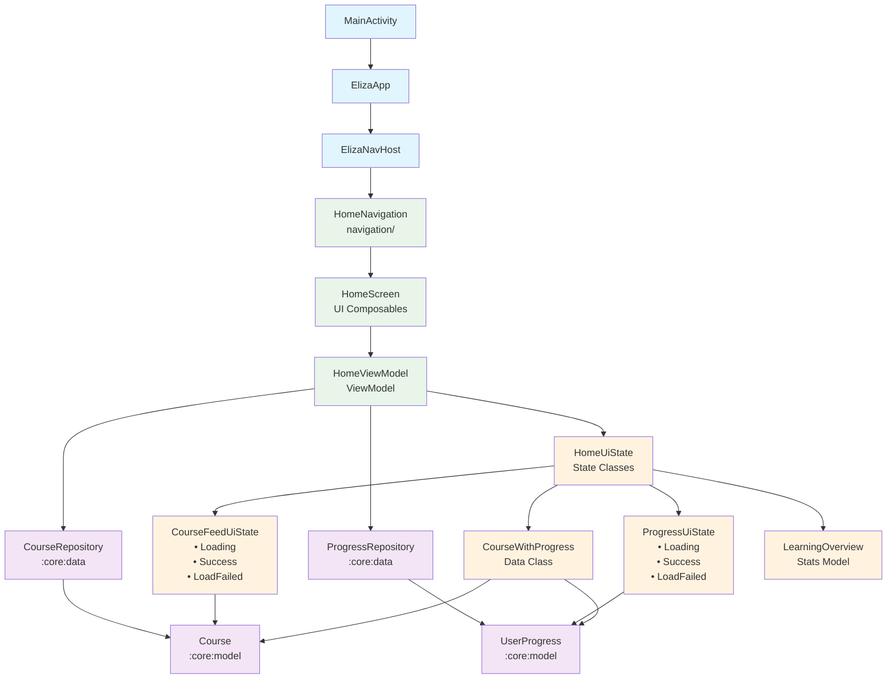
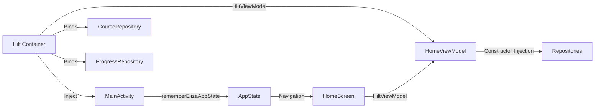

# 🏠 Feature: Home Module

The Home feature is the main landing screen of the Eliza AI Tutor app, where users can continue their learning journey or start new courses. This module follows **NowInAndroid's sophisticated architecture patterns** with proper state management, dependency injection, and modular design.

## 🏗️ Architecture Overview



## 📁 Module Structure

```
feature:home/
├── src/main/kotlin/com/example/ai/edge/eliza/feature/home/
│   ├── HomeScreen.kt           # UI Composables
│   ├── HomeUiState.kt          # State Definitions
│   ├── HomeViewModel.kt        # Business Logic & State Management
│   └── navigation/
│       └── HomeNavigation.kt   # Navigation Integration
└── build.gradle.kts           # Module Dependencies
```

## 🧩 Component Details

### 1. **HomeUiState.kt** - State Management
**Purpose**: Defines all state classes using sealed interfaces for type-safe state management

#### **CourseFeedUiState**
- `Loading`: Initial loading state
- `Success(continuingCourses, newCourses)`: Loaded course data
- `LoadFailed(exception)`: Error state with exception details

#### **ProgressUiState** 
- `Loading`: Progress data loading
- `Success(overallProgress, courseProgress)`: Learning statistics and progress
- `LoadFailed(exception)`: Progress loading error

#### **Data Models**
- `CourseWithProgress`: Combines Course with UserProgress data
- `LearningOverview`: User statistics (courses completed, streak, accuracy)
- `HomeTab`: Enum for tab selection (CONTINUE_LEARNING, START_NEW_COURSE)

### 2. **HomeViewModel.kt** - Business Logic
**Purpose**: Manages data flow, combines repositories, and exposes UI state

#### **Key Responsibilities**
- **Data Integration**: Combines `CourseRepository` and `ProgressRepository`
- **State Management**: Uses `StateFlow` with `WhileSubscribed(5_000)` strategy
- **Tab Selection**: Manages which tab is currently selected
- **Error Handling**: Wraps repository calls with try-catch and `.catch()`

#### **State Flows**
```kotlin
val courseFeedState: StateFlow<CourseFeedUiState>  // Combined course + progress data
val progressState: StateFlow<ProgressUiState>      // Learning statistics
val selectedTab: StateFlow<HomeTab>                // Current tab selection
```

#### **Data Processing**
- Separates courses into "continuing" (progress > 0) vs "new" (no progress)
- Calculates learning statistics (accuracy, streak, time spent)
- Sorts continuing courses by last studied date
- Handles repository exceptions gracefully

### 3. **HomeScreen.kt** - UI Layer
**Purpose**: Composable functions that render the home screen UI

#### **Key Composables**
- `HomeScreen()`: Main stateful composable with ViewModel integration
- `HomeScreenContent()`: Stateless UI that receives state parameters
- **Tab-based Interface**: Continue Learning vs Start New Course tabs
- **State Handling**: Loading, error, and empty states for each tab

#### **UI Features**
- **Responsive Layout**: Adapts to different screen sizes
- **Course Cards**: Displays course information with progress indicators
- **Loading States**: Proper loading indicators while data loads
- **Error Handling**: User-friendly error messages
- **Empty States**: Helpful messages when no courses available

### 4. **HomeNavigation.kt** - Navigation Integration
**Purpose**: Connects the home feature to the main app navigation system

#### **Navigation Setup**
```kotlin
const val HOME_ROUTE = "home_route"              // Screen route
const val HOME_BASE_ROUTE = "home_base_route"    // Section route

fun NavController.navigateToHome(navOptions: NavOptions)  // Navigation function
fun NavGraphBuilder.homeSection(onCourseClick: (String) -> Unit)  // Graph integration
```

#### **Integration Points**
- Used by `ElizaNavHost.kt` in the main app
- Provides course click callback for navigation to course details
- Supports nested navigation within the home section

## 🔗 Connection to MainActivity & Navigation

### **Flow Hierarchy**
```
MainActivity.kt
└── ElizaApp.kt (Container)
    └── ElizaNavHost.kt (Navigation Graph)
        └── homeSection() (From HomeNavigation.kt)
            └── HomeScreen() (Main UI)
                └── HomeViewModel (State Management)
                    ├── CourseRepository (:core:data)
                    └── ProgressRepository (:core:data)
```

### **Step-by-Step Connection**

1. **MainActivity**: 
   - Injects `NetworkMonitor` via Hilt
   - Creates `ElizaAppState` with `rememberElizaAppState()`
   - Wraps app in `ElizaTheme`

2. **ElizaApp**: 
   - Handles offline state and snackbar
   - Contains bottom navigation
   - Hosts the main navigation graph

3. **ElizaNavHost**: 
   - Defines top-level navigation structure
   - Calls `homeSection()` from HomeNavigation.kt
   - Sets up navigation callbacks

4. **homeSection()**: 
   - Creates nested navigation graph for home feature
   - Defines the HOME_ROUTE composable
   - Passes `onCourseClick` callback for course navigation

5. **HomeScreen**: 
   - Uses `@HiltViewModel` to inject `HomeViewModel`
   - Collects state flows as Compose state
   - Renders UI based on current state

6. **HomeViewModel**: 
   - Injected repositories via Hilt dependency injection
   - Combines multiple data sources using `combine()`
   - Manages lifecycle-aware state with `stateIn()`

### **State Flow & Lifecycle**

The ViewModel follows NowInAndroid's sophisticated patterns:

```kotlin
// StateFlow with proper lifecycle management
.stateIn(
    scope = viewModelScope,                    // Tied to ViewModel lifecycle
    started = SharingStarted.WhileSubscribed(5_000),  // 5-second timeout
    initialValue = CourseFeedUiState.Loading,          // Initial state
)
```

This ensures:
- **Memory Efficiency**: Stops collecting when no subscribers for 5 seconds
- **Lifecycle Awareness**: Automatically handles configuration changes
- **Proper Cleanup**: Prevents memory leaks

### **Dependency Injection Flow**



## 🎯 Key Design Patterns

1. **Unidirectional Data Flow**: Data flows down, events flow up
2. **Single Source of Truth**: ViewModel holds the canonical state
3. **Separation of Concerns**: Clear boundaries between UI, business logic, and data
4. **Reactive Programming**: Uses StateFlow and Compose state for reactive UI
5. **Error Handling**: Comprehensive error states and exception handling
6. **Testability**: Pure functions and dependency injection enable easy testing

This architecture ensures the Home feature is maintainable, testable, and follows Android development best practices while providing a smooth user experience. 