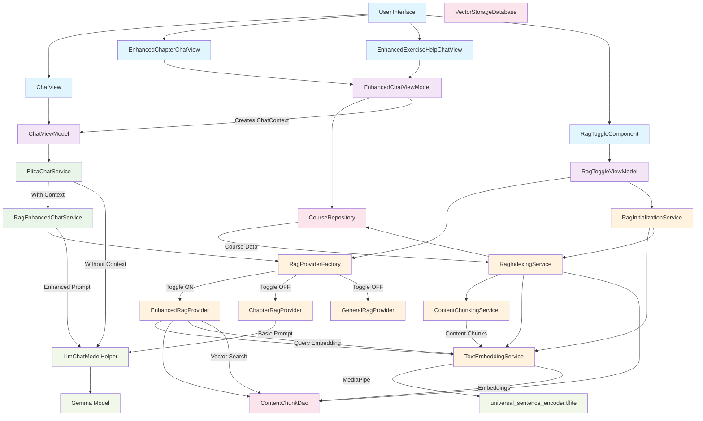

# Eliza Inference Architecture: RAG-Enhanced Chat System

## Overview

Eliza implements a sophisticated **Retrieval Augmented Generation (RAG)** system that enhances AI chat responses with contextually relevant educational content. The system supports multiple chat contexts (chapter reading, exercise solving, general tutoring) and can be toggled between basic and enhanced RAG modes.

## Architecture Components

### 1. **Chat Entry Points**
- **`ChatView`**: General-purpose chat interface with basic context
- **`EnhancedChapterChatView`**: Chapter-specific chat with full course context
- **`EnhancedExerciseHelpChatView`**: Exercise-specific chat with problem context

### 2. **Data Loading Layer**
- **`EnhancedChatViewModel`**: Loads real data from repositories to create proper ChatContext
- **`CourseRepository`**: Provides access to course, chapter, and exercise data
- **`MockCourseRepository`**: Contains rich educational content (6 courses, detailed chapters, exercises)

### 3. **Context Management**
- **`ChatContext`**: Sealed class defining different chat scenarios:
  - `GeneralTutoring`: Basic academic support
  - `ChapterReading`: Reading-specific content with chapter details
  - `ExerciseSolving`: Problem-specific context with exercise data
  - `Revision`: Review context with completed chapters

### 4. **RAG System**
- **`RagProviderFactory`**: Creates appropriate RAG providers based on context and toggle state
- **`EnhancedRagProvider`**: Vector-based semantic similarity search
- **`Basic RAG Providers`**: Simple content-based providers (ChapterRagProvider, etc.)
- **`TextEmbeddingService`**: MediaPipe-based text embedding using universal_sentence_encoder.tflite

### 5. **Vector Storage**
- **`VectorStorageDatabase`**: Room database for content chunks and embeddings
- **`ContentChunkDao`**: DAO for chunk operations and similarity search
- **`RagIndexingService`**: Indexes educational content on app startup

### 6. **Chat Services**
- **`ElizaChatService`**: Main chat orchestrator with RAG integration
- **`RagEnhancedChatService`**: RAG-specific enhancement logic
- **`LlmChatModelHelper`**: Gemma model inference engine

### 7. **RAG Toggle System**
- **`RagToggleComponent`**: UI component for enabling/disabling enhanced RAG
- **`RagToggleViewModel`**: Manages toggle state and initialization
- **`RagInitializationService`**: Handles RAG system startup and indexing

## Inference Flow

### Complete Request Flow

```
User Input → ChatView → ElizaChatService → RagEnhancedChatService → RagProvider → TextEmbeddingService → Vector Search → Enhanced Prompt → Gemma Model → Streaming Response → UI
```

### Detailed Step-by-Step Process

#### 1. **User Interaction & Context Creation**
```kotlin
// User opens chapter chat
EnhancedChapterChatView(courseId, chapterId, readingProgress)
↓
// ViewModel loads real data
enhancedViewModel.loadChapterContext(courseId, chapterId, readingProgress)
↓
// Creates ChatContext from repository data
ChatContext.ChapterReading(
    courseId = "course_algebra_1",
    courseTitle = "Algebra I Fundamentals", 
    chapterId = "chapter_linear_eq",
    chapterTitle = "Linear Equations",
    markdownContent = "# Linear Equations\nA linear equation...",
    // ... real data from CourseRepository
)
```

#### 2. **Message Processing**
```kotlin
// User types message
onSendMessage("How do I solve 2x + 5 = 15?")
↓
// ChatView processes input
chatViewModel.generateResponse(
    model = selectedModel,
    input = messageText,
    context = chatContext, // Real ChatContext with course data
    resultListener = { response, isComplete -> ... }
)
```

#### 3. **Service Layer Routing**
```kotlin
// ElizaChatService determines enhancement strategy
ElizaChatService.generateResponse()
↓
if (context != null) {
    // Route to RAG enhancement
    ragEnhancedChatService.generateEnhancedResponse(
        model, input, context, images, resultListener, onError
    )
} else {
    // Direct model inference
    LlmChatModelHelper.runInference()
}
```

#### 4. **RAG Enhancement Process**
```kotlin
// RagEnhancedChatService checks RAG availability
RagEnhancedChatService.generateEnhancedResponse()
↓
if (context != null && ragEnabled) {
    // Get appropriate RAG provider
    val ragProvider = ragProviderFactory.createEnhancedProvider(context)
    ↓
    // Enhance prompt with relevant content
    val enhancementResult = ragProvider.enhancePrompt(input, context)
    ↓
    if (enhancementResult.confidence >= 0.7) {
        // Use enhanced prompt
        generateWithPrompt(enhancedPrompt)
    } else {
        // Fallback to basic generation
        generateBasicResponse()
    }
}
```

#### 5. **Vector-Based Content Retrieval** (When RAG Toggle = ON)
```kotlin
// EnhancedRagProvider.enhancePrompt()
EnhancedRagProvider.getRelevantContent(query, context, maxChunks)
↓
// Create query embedding
val queryEmbedding = textEmbeddingService.embedText(query)
↓
// Get candidate chunks based on context
val candidateChunks = when(context) {
    is ChatContext.ChapterReading -> contentChunkDao.getChunksByChapter(context.chapterId)
    is ChatContext.ExerciseSolving -> contentChunkDao.getChunksByChapter(context.chapterId)
    // ... other contexts
}
↓
// Find similar chunks using cosine similarity
val similarChunks = findSimilarChunks(queryEmbedding, candidateChunks)
↓
// Build enhanced prompt with retrieved context
val enhancedPrompt = buildVectorEnhancedPrompt(originalPrompt, chunks, context)
```

#### 6. **Model Inference**
```kotlin
// Enhanced or basic prompt goes to model
LlmChatModelHelper.runInference(
    prompt = enhancedPrompt, // Contains relevant educational context
    model = selectedModel,
    resultListener = streamingResponseHandler
)
↓
// Gemma model processes enhanced prompt
// Returns contextually relevant educational response
```

## RAG Toggle: What Actually Changes

### **Toggle OFF (Basic RAG)**
- **Provider**: Uses context-specific basic providers:
  - `ChapterRagProvider`: Simple chapter content inclusion
  - `GeneralRagProvider`: Basic educational context
  - `ExerciseRagProvider`: Exercise-specific context
  - `RevisionRagProvider`: Revision content
- **Content Retrieval**: Direct chapter/exercise content inclusion
- **Prompt Enhancement**: Simple template-based enhancement
- **Performance**: Fast, minimal processing

### **Toggle ON (Enhanced RAG)**
- **Provider**: Uses `EnhancedRagProvider` for all contexts
- **Content Retrieval**: Vector-based semantic similarity search
- **Embedding Process**: 
  1. Query text → MediaPipe embeddings
  2. Vector similarity search in indexed content
  3. Multi-vector retrieval strategy (summaries + details)
- **Prompt Enhancement**: Intelligent context assembly with relevance scores
- **Performance**: Slower but more accurate and contextually relevant

### **Toggle State Management**
```kotlin
// Toggle UI Component
RagToggleComponent → RagToggleViewModel.toggleRag(enabled)
↓
if (enabled) {
    ragInitializationService.initializeSync() // Initialize embeddings/indexing
    ragProviderFactory.setUseEnhancedRag(true)
} else {
    ragProviderFactory.setUseEnhancedRag(false)
}
↓
// Provider selection in factory
RagProviderFactory.createProvider(context) {
    return if (useEnhancedRag) {
        createEnhancedProvider(context) // Vector-based
    } else {
        createBasicProvider(context)    // Template-based
    }
}
```

## Content Indexing & Vector Storage

### **Initialization Process**
```kotlin
// App startup
ElizaApplication.onCreate()
↓
ragInitializationService.initializeAsync()
↓
1. textEmbeddingService.initialize() // Load MediaPipe model
2. ragIndexingService.indexAllMockData() // Index educational content
   ↓
   For each course → For each chapter:
   a. contentChunkingService.chunkChapterContent() // Break into chunks
   b. textEmbeddingService.embedTexts() // Create embeddings
   c. contentChunkDao.insertChunks() // Store in vector database
```

### **Vector Storage Schema**
```kotlin
ContentChunkEntity {
    id: String,
    courseId: String,
    chapterId: String,
    title: String,
    content: String, // Actual educational content
    chunkType: String, // SUMMARY, CHAPTER_SECTION, EXAMPLE, etc.
    embedding: FloatArray, // 512-dimensional vector from MediaPipe
    source: String,
    metadata: Map<String, String>
}
```

### **Content Types Indexed**
- **Course Overviews**: High-level subject descriptions
- **Chapter Summaries**: Key concepts and learning objectives  
- **Detailed Sections**: Step-by-step explanations and examples
- **Exercise Content**: Problem statements and solution methods
- **Code Examples**: Programming demonstrations (for applicable subjects)

## Performance & Optimization

### **Embedding Model**
- **Model**: `universal_sentence_encoder.tflite` (6.1MB)
- **Dimensions**: 512-dimensional embeddings
- **Initialization**: ~2-3 seconds on app startup
- **Inference**: ~50-100ms per text embedding

### **Vector Search**
- **Strategy**: Multi-vector retrieval (summaries + details)
- **Similarity**: Cosine similarity with 0.7 threshold
- **Batch Processing**: 10 chunks per batch during indexing
- **Cache**: Room database with persistent storage

### **Response Times**
- **Basic RAG**: ~100-200ms enhancement overhead
- **Enhanced RAG**: ~300-500ms including vector search
- **Model Inference**: Depends on Gemma model size and device
- **Total**: Enhanced responses typically 500-800ms longer than basic

## Error Handling & Fallbacks

### **Graceful Degradation**
1. **Enhanced RAG Fails** → Falls back to Basic RAG
2. **Basic RAG Fails** → Direct model inference
3. **Model Fails** → Error message with retry option
4. **Embedding Service Fails** → Continues with basic providers

### **Confidence Scoring**
```kotlin
PromptEnhancementResult {
    confidence: Float, // 0.0 - 1.0
    enhancedPrompt: EnhancedPrompt,
    processingTime: Long,
    chunksUsed: Int
}

// Usage threshold
if (enhancementResult.confidence >= 0.7) {
    useEnhancedPrompt()
} else {
    fallbackToBasic()
}
```

## Architecture Diagram



## Key Integration Points

### **1. Context Creation**
Real data from `CourseRepository` → `ChatContext` → RAG enhancement

### **2. Provider Selection**  
Toggle state → `RagProviderFactory` → Enhanced vs Basic providers

### **3. Content Retrieval**
ChatContext → Candidate chunks → Vector search → Relevant content

### **4. Prompt Enhancement**
Original prompt + Retrieved content → Enhanced prompt with context

### **5. Response Generation**
Enhanced prompt → Gemma model → Contextually relevant response

## Testing & Validation

### **Content Verification**
- Mock repository contains 6 courses with detailed content
- RAG indexing processes ~50+ content chunks
- Vector embeddings verified for educational accuracy


### **Quality Metrics**
- Confidence scoring: 0.6+ threshold for enhanced responses
- Relevance: Cosine similarity >0.6 for included chunks
- Coverage: Multi-vector strategy ensures comprehensive context

## Future Enhancements

### **Planned Improvements**
1. **Dynamic Indexing**: Real-time content updates
2. **Personalization**: User-specific content weighting
3. **Cross-Chapter Retrieval**: Connecting concepts across chapters
4. **Performance Optimization**: Caching and pre-computation
5. **Quality Metrics**: Enhanced relevance scoring

### **Extensibility Points**
- **New Content Types**: Video transcripts, interactive exercises
- **Additional Models**: Alternative embedding models
- **Search Strategies**: Hybrid retrieval methods
- **Context Types**: New chat scenarios and use cases

---

*This document serves as the definitive reference for Eliza's RAG-enhanced inference architecture. All components work together to provide contextually relevant, educationally accurate AI responses that enhance the learning experience.*